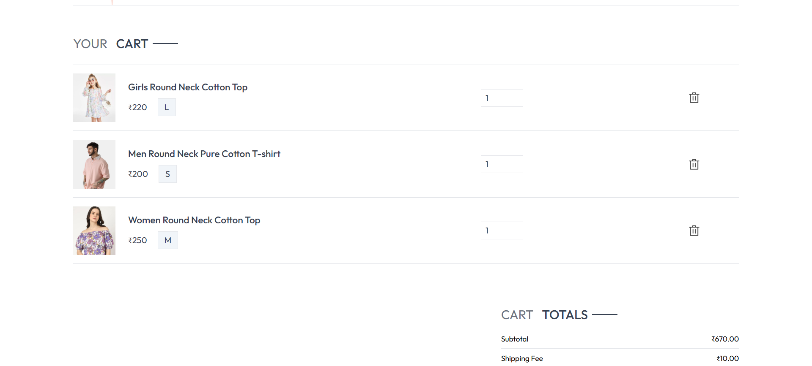
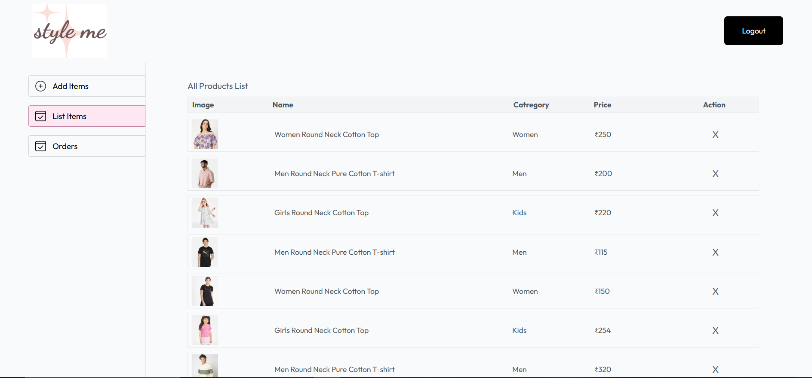

# 🛍️ **Style Me**

## **E-Commerce Platform**

## **Description**

**This single-page application (SPA) includes multiple pages:**

- **Home Page:** Displays products for users to browse.
- **Product Detail Page:** Shows detailed information about a product.
- **Login/Signup:** Users can sign in or sign up.
- **Cart:** Users can add products to the cart, view a cart preview, and adjust quantities or remove items.
- **Checkout Page:** Users fill in their contact information, and the address details. Stripe is integrated for payment processing.
- **Order Confirmation and Details:** After checkout, users are redirected to an order details page to see the order status.
- **Product Search:** Users can search for products by typing keywords or by category.
- **Product Filter:** Users can filter products based on the selected category.

### Additional features include:

#### **Admin Panel:**

- Manage orders and update their status to "shipped",etc.
- Add, update and remove products also.

### **Test Users**

- **User :** testuser@gmail.com | Password: 123456789
- **Admin :** admin@styleme.com | Password: ldGj9s1sI7g

 > **Note :** You can only create an account for the User role via the Sign Up page. The Admin account is predefined and is used for testing the role.

### **User Features**

- **User Registration and Login:** Users can sign up or sign in.
- **Home Page:** Displays a list of products for users to browse.
- **Product Detail Page:** Shows detailed information about each product.
- **Shopping Cart:** Users can add products to their cart, view a cart preview, and adjust quantities or remove items.
- **Checkout:** Users can fill in their contact information, and address. Stripe is integrated for payment processing.
- **Order Confirmation and Details:** After checkout, users are redirected to an order details page to see the order status.
- **Product Search:** Users can search for products by typing keywords or by category.
- **Product Filter:** Users can filter products based on the selected category.

## **Technologies Used**

## **Frontend**

- **React:** ^18.3.1
- **Axios:** ^1.7.9
- **React Dom:** ^18.3.1
- **React Router Dom:** ^7.1.2
- **React Toastify:** ^11.0.3
- **Tailwind CSS:** ^3.4.17

## **Backend**

- **Bcrypt**: `^5.1.1`
- **Cloudinary**: `^2.5.1`
- **Cors**: `^2.8.5`
- **Dotenv**: `^16.4.7`
- **Express**: `^4.21.2`
- **Jsonwebtoken**: `^9.0.2`
- **Mongodb**: `^6.13.0`
- **Mongoose**: `^8.10.0`
- **Multer**: `^1.4.5-lts.1`
- **Nodemon**: `^3.1.9`
- **Stripe**: `^17.6.0`
- **Validator**: `^13.12.0`

> **Note :** These dependencies are necessary to run the project. To install them, use `npm install` or `yarn install`.

## **Usage**

**This is a web application. Simply land on the webpage and start using it. For additional features, users need to log in.**

## **Installation & Setup Guide**

### **Clone the Repository**

```
git clone https://github.com/NishuPriya05/Style-Me
cd Style-Me
```

### **Install Dependencies**

#### **For the frontend:**

```
cd Frontend
npm install
npm run dev
```

#### **For the backend:**

```
cd Backend
npm install
npm run server
```

#### **For the Admin:**

```
cd admin
npm install
npm run dev
```

### **Set Up Environment Variables**

Copy the .env.sample file and rename it to .env, then fill in the required credentials.

Edit the .env file with your API keys and database connection details.

<<<<<<< HEAD
> **Note:** Make sure not to share your .env file publicly or commit it to version control.
=======
**Note:** Make sure not to share your .env file publicly or commit it to version control.
>>>>>>> 95fe4c5ad3331bcd93c29b2a91013435cb1e1fcd

## **Features Breakdown with Screenshots**

## User Panel Screenshots

### 🏠 Home Page


### 🛒 Cart Page



### 🛒 Shop by Category


### ✅ Checkout Page


## Admin Panel Screenshots

### 📊 Add Items


### 🛒 Manage Products



### 📦 Orders Management


## **Deployment Guide:**

### **🌍 Live Deployment Links**

#### _🖥️ Frontend :_ https://style-me-pi.vercel.app/

#### _🔧 Admin :_ https://style-me-adminpanel.vercel.app/

## **Contributing Guidelines :**

**Contributions are welcome! Please fork this repo and submit a pull request with a clear description of the changes.**
